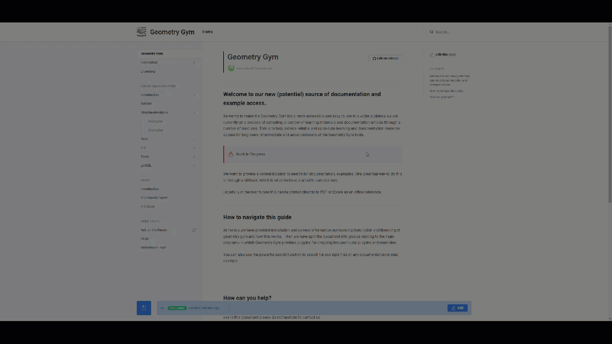

# Geometry Gym

## Welcome to our new \(potential\) source of documentation and example access. 

As we try to make the Geometry Gym tools more accessible and easy to use to a wider audience we are currently on a process of compiling a number of learning materials and documentation articles through a number of mediums. This is to help provide reliable and up-to-date learning and documentation resource access for beginners, intermediate and advanced users of the Geometry Gym tools. 


Work In Progress. 


We want to provide a central location to search for documentation, examples and FAQs. One potential way to do this is through a GitBook \(This book\), which is what we have started to compile here. 

Hopefully in the near future this can be printed directly to PDF or Ebook as an office reference.

## How to navigate this guide

At the top we have provided installation and general information surrounding installation and licencing of geometry gym and how this works.  Then we have split the document into groups relating to the main programs in-which Geometry Gym provides plug-ins for dropping into particular plug-ins and examples. 

You can also use the powerful search function to search for example files or any documentation related example. 

## How can you help?

If you would like to help or have any particular requests around specific information that you would like to see in this document please do not hesitate to contact us. 

We are always looking for ways to improve the tools and getting feedback from the users is paramount to help provide a good working product.

If you are willing to provide any worked examples or documentation that has been completed on Geometry Gym applications which you would like to see in this online document please let us know.

In the future we may allow direct edit access to this book via branches in GitHub.

