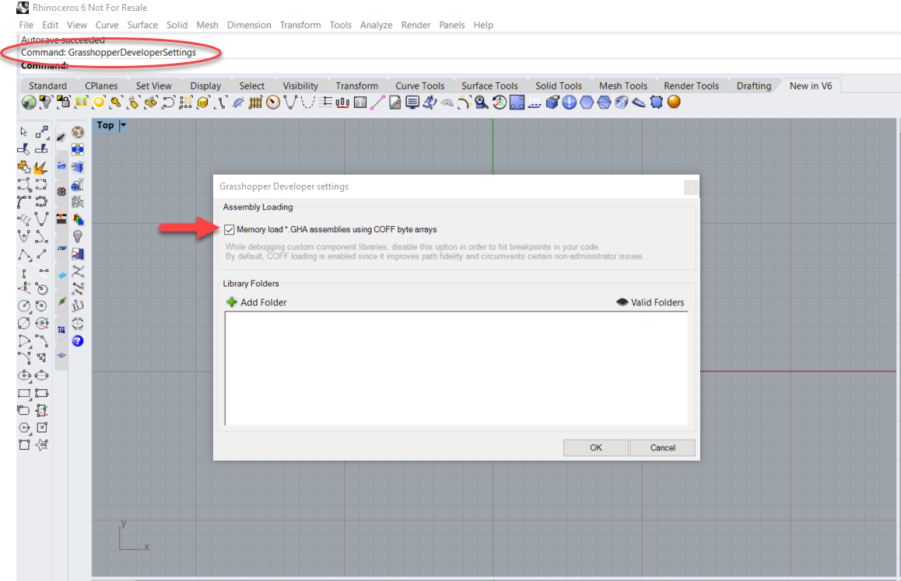

# Common Installation Issues

## Rhino Plug-ins not Loading

If you cannot view the `gg` commands or toolbars you can manually load the rhino plug-in files \(`.rhp`\)

The typical plugin installed location is:

Version 5: `C:\Program Files (x86)\Geometry Gym\Rhino3d` 

Version 6: `C:\Program Files\Geometry Gym\Rhino3d`

Browse to this folder and drag and drop the `.rhp` files over the Rhino application window \(or load from rhino plugin manager\).

## Can not see Geometry Gym Rhino Toolbars

If the Rhino toolbars have not automatically loaded they can also be loaded manually.

the typical rhino toolbar files `.rui` can be found:

Version 5: `C:\Users\??USER??\AppData\Roaming\GeometryGym\GeometryGym.rui`  

Version 6: `C:\Users\??USER??\AppData\Roaming\GeometryGym\??Plug-in??`


In version 6 each plug-in is loaded with an individual toolbar so these should be loaded one by one. 


Due to feedback, in Rhino version 6 toolbars are not automatically grouped. You can follow the steps at the location below to create a toolbar group in rhino. 



## Cannot View Geometry Gym Grasshopper Tabs

If these haven’t appeared try one of the following. If still having issues please contact us. 

**Update Grasshopper**

The most obvious solution is either update Grasshopper \(if not running latest\)

**Observe Grasshopper Loading Errors**

As grasshopper starts it will generally provide errors if something has not loaded correctly. Check for loading error reports as grasshopper starts. If specific to Geometry Gym then please contact us as soon as possible.  

**Check Grasshopper Developer Settings** 

Run Rhino command GrasshopperDeveloperSettings and **tick** COFF loading. Previous versions commonly required COFF loading to be not checked, so try toggling if having problems.

