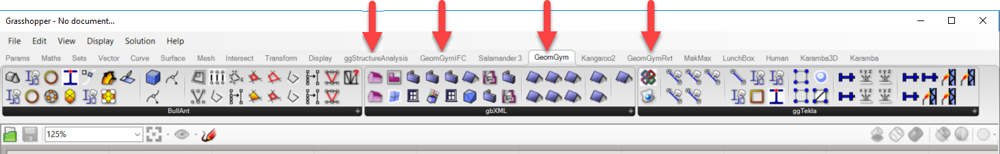

# Installation

The steps below outline how to install the geometry gym plug-ins for Rhino and Revit. For the majority of users, installation is simply a matter however, If you have problems through the process please contact us.

An automated update may be possible in the near future.

## Before Installing 

Rhino plug-ins require Rhino to be installed and it is recommended that Grasshopper is also installed. Note since Rhino6, Grasshopper is built in but for Rhino5 must be installed independently.  

Revit plug-ins will require Revit to be installed


Know which version of associated applications are installed on your computer. We currently provide public installers for Rhino5, Rhino6 and RhinoMac.  We also support recent builds of Revit and Tekla. If you cannot find the version that you require please contact us. Most Structural Analysis connectors also version specific.  You can typically only install one specific version \(which will permit legacy use of Grasshopper scripts in the future when newer versions are in use without upgrading or replacing components\).


You can download a trial version of the latest Rhino [here](https://www.rhino3d.com/download). 

## Step 1 - Download Installers

The latest Geometry Gym installer files can be downloaded from the downloads page \(.msi for Windows developments and .macrhi for RhinoMac\):

#### [www.geometrygym.com/downloads](http://www.geometrygym.com/downloads) 


It is highly recommend that **BullAnt** \(formerly known as StructDrawRhino\) is installed as a base as there are a lot of tools in which the other plug-ins rely on for streamlining workflows.


## Step 2 - Installing plug-ins


Make sure the Rhino or Revit application is not running prior to following these steps.


1. Find the installers from the folder that you selected at download or simple use the run command from your internet browser. 
2. Run each of the installers by double clicking \(windows security might take a few seconds prior to permitting installation\).

The installer will attempt to create registry keys \(windows\) to instruct Rhino to load these plugins when starting. 

## Step  3 - Open Rhino

If you installed for the first time, Rhino should report loading of new plugins. Click okay to acknowledge these changes.

The plug-ins should now be installed and ready to use. New rhino commands starting with '`gg`'  should now be available in the command line along with a number of specific rhino toolbars:

If you cannot view the 'gg' commands from the command line you may need to manually install the rhino plug-ins. Please follow the link below for some common issues that can occur during installation.



If you are still experiencing issues after these steps please contact us. 

### Grasshopper

After installing, plug-in tabs in Grasshopper should also be added: 

Only tabs which include the plug-in you have installed will be provided. If the grasshopper tabs are not loading these can also be loaded manually. Please follow the link above for common installation issues.

## Step 3 - Request Licence

Geometry Gym do charge for software developments for commercial work to enable full time development of the plug-ins and tools. However, we do provide a 30 day trial to the tools. 

You can read more about the Geometry Gym licencing system or inquire about purchasing a full licence [here](http://www.geometrygym.com/purchase).


A trial licence needs to be requested prior to being able to use majority of the tools.


To Request a trial licence:

1. Run the rhino command `ggZZLicenseRequest` command within Rhino and a dialog will present as shown below:

If you a variant of Outlook/Windows Live installed, you can accept the option for an email to be prepared to send to me. If not, the xml text data I need will have already been placed in Windows Clipboard. 

Simply, Paste \(Menu – Edit- Paste or &lt;CTRL&gt; – v\) into an email to Jon \(jonm@geometrygym.com\). 


We endeavor to respond to license requests as quickly as possible \(If online it will be near immediate\). If you haven’t gotten a reply within a day, please check email was sent or chase me up with another email.


## Step 4 - Activating Licence

Once you have received an .xml licence file from Jon via email.Follow the steps below to apply the licence:

1. Save the file in a logical place on your hard drive. This can be save anywhere. 
2. Run the  `ggZZLicenceUpdate` command similar to step 3 above in the rhino window.
3. A browse window will appear which will allow you to browse to the saved licence file location. 
4. Click okay, and you should retrieve a message stating "Successful Licence Installation". 

