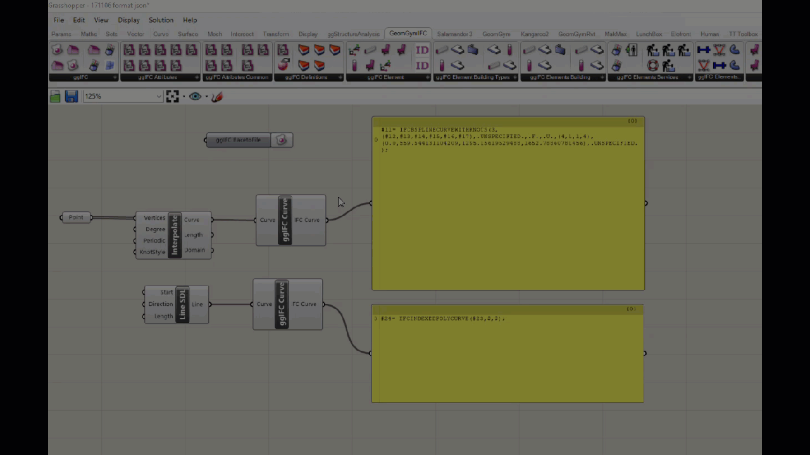

# Getting Started

## IFC tools for Rhino

## Generation of IFC within Grasshopper 

The ggIFC plug-in allows for the generation and manipulation of existing IFC files. It is a powerful tool which allows to access to the powerful IFC data model and export sophisticated IFC models to a number of different applications which support IFC file imports across multiple industries in the built environment.

Current capabilities include:

* * All general building elements for Architectural, Structural, Services
* Planning or project management

## Creating an IFC project from Scratch

## Canvas output text Options 

Within the grasshopper canvas you can select which output text string format you would like to view depending on your preference.

* .xml
* .step
* .json


If the text does not auto-update press F5 to refresh the Grasshopper canvas


 

 

