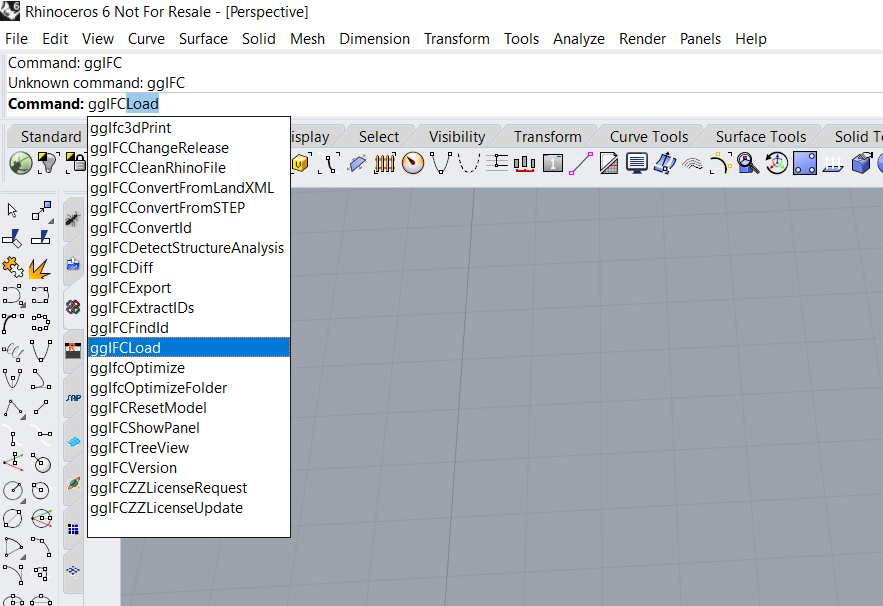

# IFC tools for Rhino

Watch this Youtube video for a short introduction to Geometry Gym Rhino IFC

\[create youtube video\]

## IFC Rhino Commands

### IFC 3d Print

### IFC Clean Rhino File

### IFC Convert from LandXML

### IFC Convert from Step

### IFC Convert Id

### IFC Detect Structural Analysis

### IFC Diff

### IFC Export

### IFC Extract Ids

### IFC Find Id

### IFC Load

### IFC Optimize

### IFC Optimize Folder

### IFC Reset Model

### IFC Show Panel

### IFC Tree View

### IFC Version

